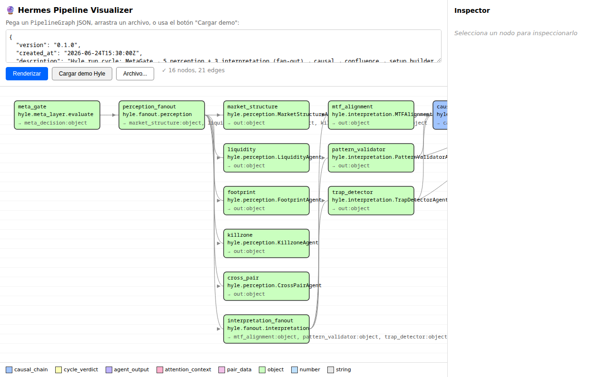
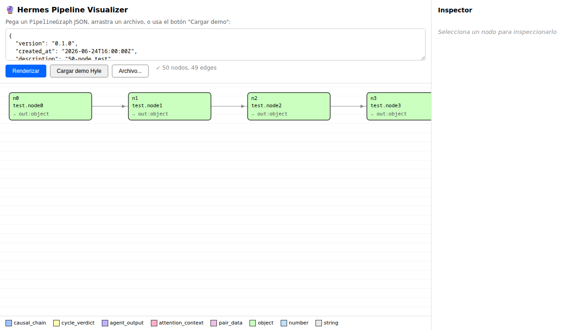

# Hermes Pipeline Visualizer

A small tool (mine, not a project) for visualizing cognitive pipeline graphs
as DAGs. Inspired by ComfyUI's DAG JSON format, but with **own spec** and
**no GPL code** (Route B per `~/.hermes/RULES_UPSTREAM_FOREVER.md`).

## What it is

3 components, ~400 LoC total:

| Component | Purpose | Tech |
|---|---|---|
| `spec/graph.py` | DAG JSON spec + Pydantic v2 validator | Python |
| `executor/runner.py` | Async pipeline runner (Kahn topo-sort) | Python asyncio |
| `visualizer/visualizer.html` | Static HTML visualizer, no build step | D3.js v7 from CDN |
| `demos/hyle_cycle/` | Real Hyle cycle demo (16 nodes, 21 edges) | JSON + stubs |

## Visualizer screenshot

### Hyle cycle (16 nodes, manual layout)



### Big graph (50 nodes, dagre layout auto-loaded)



Both screenshots show the visualizer rendering real demo graphs:
- Hyle: 16 nodes color-coded by output type, 21 edges drawn as arrows
- Big: 50 nodes via dagre.js (lazy-loaded from CDN when graph crosses threshold)
- Inspector sidebar shows details on click

## Use it

### 1. Visualize any pipeline graph

```bash
# Start a local HTTP server (visualizer needs fetch() for the demo)
cd ~/hermes-pipeline-visualizer
python3 -m http.server 8766 --bind 127.0.0.1
# Then open http://127.0.0.1:8766/visualizer/visualizer.html in your browser
# Click "Cargar demo Hyle" or paste your own JSON
```

Or open `visualizer/visualizer.html` directly with `file://` — the paste textarea
and file picker work without a server. Only the "Cargar demo" button needs HTTP.

### 2. Run the demo end-to-end (validates spec + executor)

```bash
cd ~/hermes-pipeline-visualizer
python3 demos/hyle_cycle/run.py
```

Expected output:
```
=== FINAL OUTPUTS (governor + synthesis) ===
{
  "governor": {"verdict": "approved"},
  "synthesis": {"markdown": {"stub": true, "node": "synthesis", "got_inputs": ["setup", "verdict"]}}
}

=== EXECUTION SUMMARY ===
  Nodes executed:    16/16
  Progress events:   32 (16 node pairs)
  Edge count:        21
✓ Demo passed smoke assertions
```

### 3. Run the test suite

```bash
cd ~/hermes-pipeline-visualizer
python3 -m pytest tests/ -v
# 22 tests (12 spec + 10 executor) — all should pass
```

## DAG JSON spec

```json
{
  "version": "0.1.0",
  "created_at": "2026-06-24T15:30:00Z",
  "description": "...",
  "nodes": [
    {
      "id": "fetch_macro",
      "class_type": "aetheer.gather_market_context",
      "inputs": {"query": "EURUSD H1"},
      "outputs": {"market_context": {"type": "object"}}
    },
    {
      "id": "llm_reason",
      "class_type": "aetheer.specialist",
      "inputs": {
        "context": {"from": "fetch_macro", "output": "market_context"},
        "specialist_name": "macro"
      },
      "outputs": {"agent_output": {"type": "agent_output"}}
    }
  ]
}
```

### Allowed output types

**Primitives**: `string`, `number`, `boolean`, `object`, `array`, `null`

**Custom cognitive types** (first-class, so the visualizer can color them):
- `causal_chain` — Aetheer: CausalChain
- `pair_data` — Hyle: PairData
- `cycle_verdict` — Hyle: `wait` / `no_setup` / `setup` / `vetoed`
- `agent_output` — Aetheer: AgentOutput
- `attention_context` — Aetheer: AttentionContext
- `perception_bundle` — Hyle: PerceptionBundle
- `quality_breakdown` — Aetheer: QualityBreakdown

Unknown types are rejected at validation time (`extra="forbid"` on Port).

## How refs work

Refs are JSON objects with `from` (node_id) and `output` (port name):

```json
{"from": "fetch_macro", "output": "market_context"}
```

- Refs in inputs are resolved from the executor's per-node output cache
- Missing upstream node → `ValueError` at topo-sort
- Missing upstream output → `RuntimeError` at execute
- Cycle → `CycleError` from Kahn's algorithm
- Handler that returns fewer outputs than declared → `RuntimeError` at execute

## Limitations (intentional, MVP)

- For graphs with ≥30 nodes, dagre.js is lazy-loaded from CDN
  (`https://cdn.jsdelivr.net/npm/dagre@0.8.5/dist/dagre.min.js`). The first
  load takes ~200-500ms; subsequent loads use the browser cache. The threshold
  is a constant `DAGRE_THRESHOLD = 30` in `visualizer.html` — change it there.
- No HTTP server for live streaming — bonus, not core
- No persistence of executions — `_cache` dies with the process
- No visual graph editor (drag-to-add) — that would be a ComfyUI clone
- Demo handlers are stubs, not the real Hyle code (keeps this repo independent of `~/Ousia/hyle/`)

## Hybrid layout (Phase 4)

The visualizer picks a layout strategy based on graph size:

| Node count | Layout | CDN dep | First-load cost |
|---|---|---|---|
| < 30 | `layoutManual` (built-in, hierarchical) | None | 0ms (offline-capable) |
| ≥ 30 | `layoutDagre` (dagre.js from CDN) | jsdelivr | ~200-500ms (cached after) |

The decision function `shouldUseDagre(nodeCount, threshold=30)` is unit-tested
in `tests/test_visualizer_layout.py`. A second demo at
`demos/big_graph/big_graph.json` (50 nodes) exercises the dagre path — click
"Cargar demo 50 nodos (dagre)" in the toolbar.

If dagre.js fails to load (e.g. offline), the visualizer falls back to the
manual layout and shows a warning in the status bar. No data is lost.

## License

MIT. See [LICENSE](LICENSE). All source files include the
`SPDX-License-Identifier: MIT` header.

## References

- Design doc: `~/.hermes/decisions/0002-hermes-pipeline-visualizer-mvp.md`
- ComfyUI's DAG JSON format (inspiration only, no code reuse): https://github.com/Comfy-Org/ComfyUI
- UPSTREAM-FOREVER rule: `~/.hermes/RULES_UPSTREAM_FOREVER.md`
